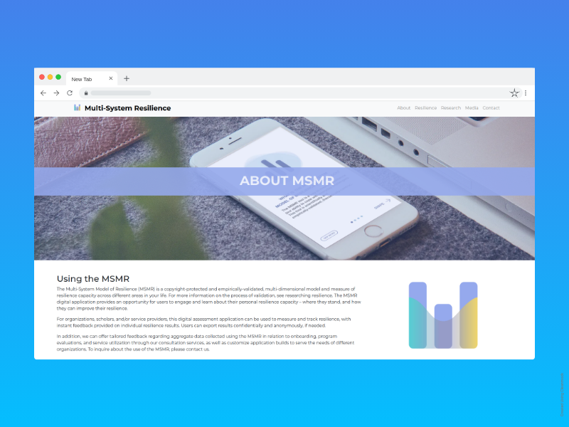
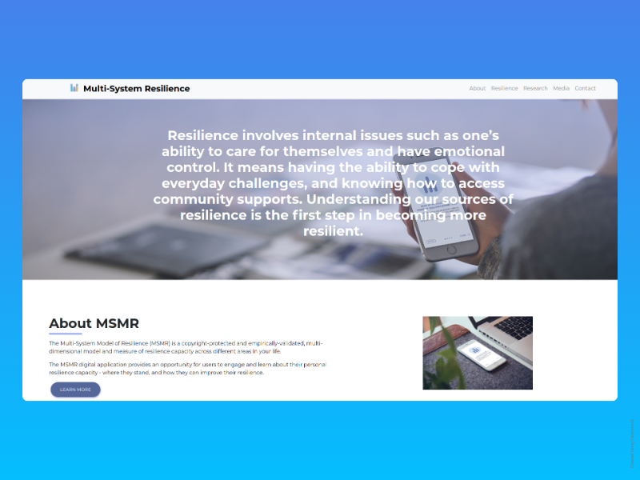

# Multi-System Model of Resilience (MSMR) Website

---





---

## About

The Multi-System Model of Resilience (MSMR) is a copyright-protected and empirically-validated, multi-dimensional model and measure of resilience capacity across different areas in your life.

The MSMR digital application provides an opportunity for users to engage and learn about their personal resilience capacity - where they stand, and how they can improve their resilience.

---

## Sponsors of Multi-System Model of Resilience Research

<table>
  <tr>
    <td>Ryerson University</td>
     <td>Royal Bank of Canada</td>
     <td>Canadian Psychological Association</td>
  </tr>
  <tr>
    <td></td>
    <td></td>
    <td></td>
  </tr>
 </table>

---

## Getting Started

First, run the development server:

```bash
npm run dev
# or
yarn dev
```

Open [http://localhost:3000](http://localhost:3000) with your browser to see the result.

You can start editing the page by modifying `pages/index.js`. The page auto-updates as you edit the file.

---

## Contact

Charles Liu - c.liu@cacheandcookies.ca

Jimmy Yang - j.yang@cacheandcookies.ca

Oren Leung - o.leung@cacheandcookies.ca

Phillip Chen

William Shi

---
